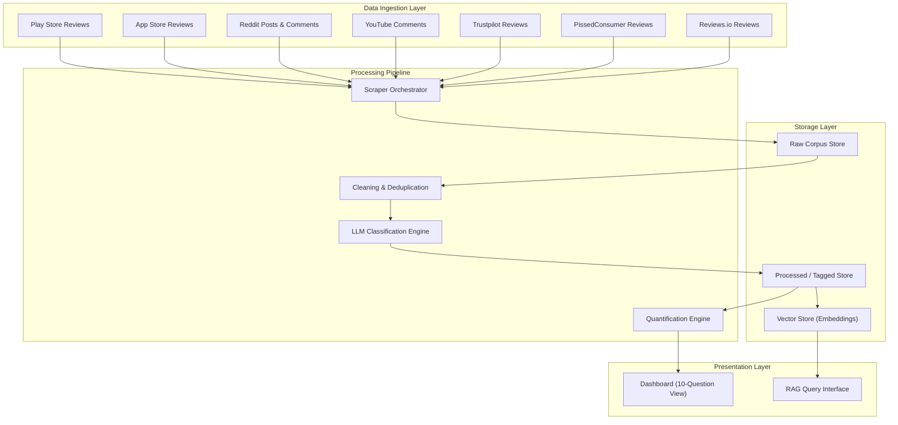
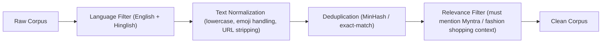
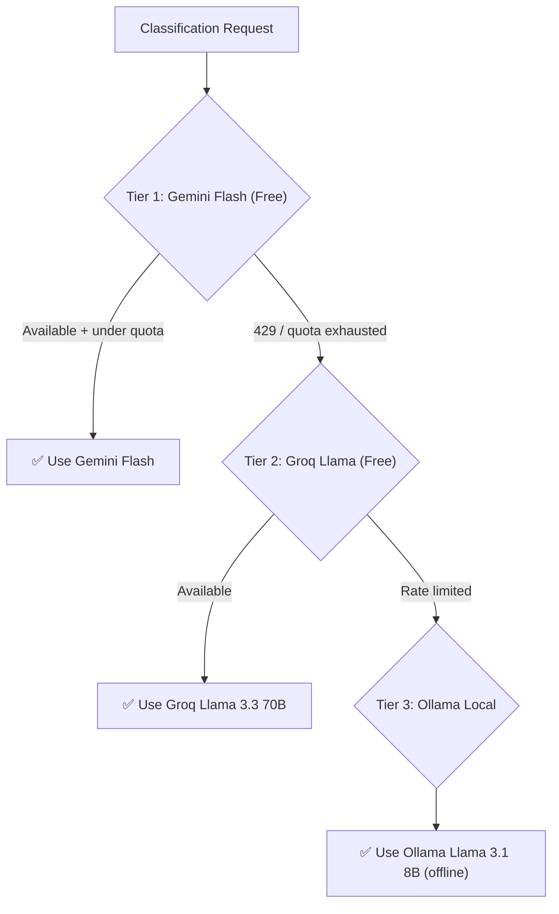
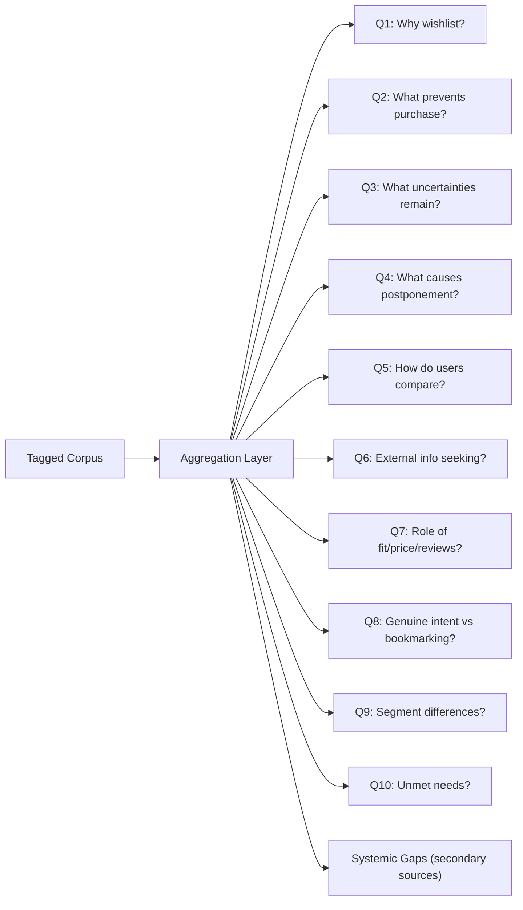
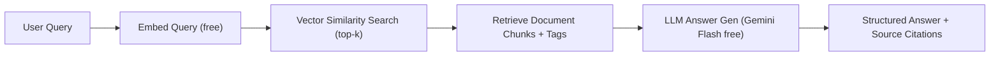
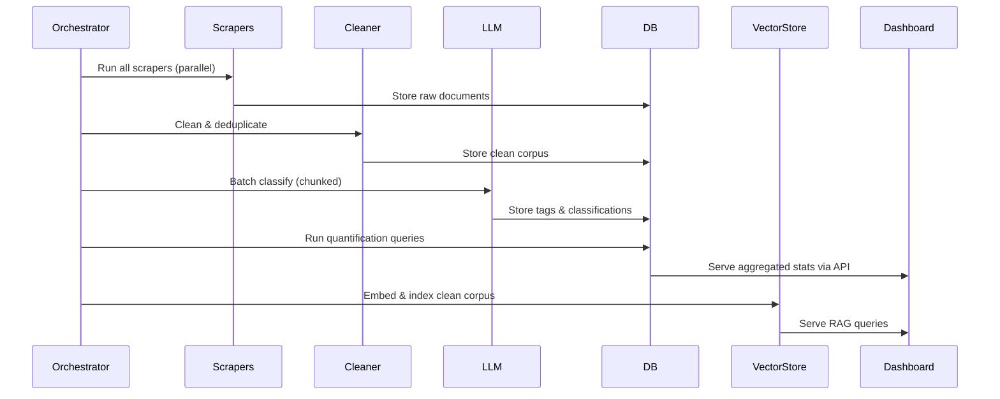
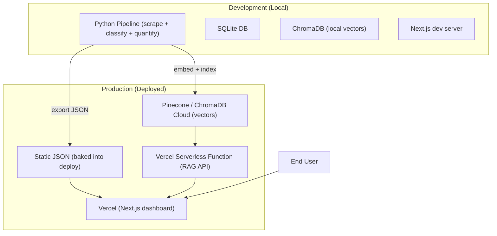

# AI-Powered Discovery Engine — Architecture Document
### Product: Myntra | Build Tool: Antigravity

---

## 1. System Overview

The Discovery Engine is a **batch-first, hybrid intelligence system** that ingests public user feedback from multiple sources, classifies it using LLM-powered tagging, quantifies opportunity areas, and surfaces findings through a structured dashboard with an interactive RAG query layer.



---

## 2. Layer-by-Layer Architecture

### 2.1 Data Ingestion Layer

Each source has a dedicated scraper module. All scrapers conform to a common interface and output a unified document schema.

#### Source Matrix

| Source | Type | Access Method | Rate Limits / Constraints | Expected Volume |
|---|---|---|---|---|
| Play Store | Primary | `google-play-scraper` (npm/Python) | Unofficial; no auth; semi-fragile at scale | High (~50K+ reviews) |
| App Store | Primary | Apple RSS feed + scraping | No official bulk API; India volume is low | Low–Medium (~5K–10K) |
| Reddit | Primary | PRAW (Official API) | OAuth required; 60 req/min | Medium (~10K–20K posts+comments) |
| YouTube | Primary | YouTube Data API v3 | API key required; 10K units/day quota | Medium (~5K–15K comments) |
| Trustpilot | Secondary | Web scraping (BeautifulSoup/Playwright) | No official API for free; anti-bot measures | Low (~2K–5K) |
| PissedConsumer | Secondary | Web scraping | Anti-bot measures; complaint-skewed | Low (~1K–3K) |
| Reviews.io | Secondary | Web scraping | Thin Myntra presence | Very Low (<1K) |

#### Unified Document Schema

Every scraped item is normalized into this schema before storage:

```json
{
  "doc_id": "uuid-v4",
  "source": "playstore | appstore | reddit | youtube | trustpilot | pissedconsumer | reviewsio",
  "source_type": "primary | secondary",
  "source_id": "original-platform-id",
  "author": "anonymized-username",
  "content": "raw text body",
  "title": "optional — reddit post title, video title, etc.",
  "rating": "numeric or null (1–5 for app stores, null for reddit/youtube)",
  "timestamp": "ISO-8601",
  "url": "permalink to original",
  "metadata": {
    "subreddit": "optional",
    "video_id": "optional",
    "parent_id": "optional (for threaded comments)",
    "upvotes": "optional",
    "app_version": "optional"
  },
  "scraped_at": "ISO-8601"
}
```

#### Scraper Orchestrator

```
scrapers/
├── base_scraper.py          # Abstract base class — common interface
├── playstore_scraper.py     # google-play-scraper wrapper
├── appstore_scraper.py      # RSS feed + fallback scraper
├── reddit_scraper.py        # PRAW-based, targets specific subreddits
├── youtube_scraper.py       # YouTube Data API v3 client
├── trustpilot_scraper.py    # BeautifulSoup / Playwright scraper
├── pissedconsumer_scraper.py
├── reviewsio_scraper.py
├── orchestrator.py          # Runs all scrapers, handles retries/failures
└── config.py                # API keys, target subreddits, video IDs, etc.
```

**Target subreddits:** `r/IndianFashionAddicts`, `r/india`, `r/twoxindia`, `r/IndianSkincareAddicts` (crossover), `r/Myntra` (if exists)

**YouTube targeting strategy:** Search for "Myntra haul", "Myntra review", "Myntra wishlist", "Myntra shopping" — extract video IDs → pull comment threads.

---

### 2.2 Cleaning & Deduplication



| Step | Logic | Tool / Method |
|---|---|---|
| Language Filter | Keep English and Hinglish; discard non-Latin scripts | `langdetect` + regex heuristics |
| Text Normalization | Lowercase, strip URLs, normalize unicode, preserve emojis-as-text | Custom pipeline |
| Deduplication | Exact hash + MinHash (Jaccard > 0.85 = duplicate) | `datasketch` library |
| Relevance Filter | Must contain fashion/shopping/Myntra signals; drops pure service rants from secondary sources unless they mention purchase hesitation | Keyword + lightweight classifier |
| Length Filter | Drop reviews < 10 words (low signal) | Simple heuristic |

---

### 2.3 LLM Classification Engine

This is the core intelligence layer. Each cleaned document is passed through an LLM to extract structured tags mapped to the 10 discovery questions.

#### Classification Schema

```json
{
  "doc_id": "references unified doc",
  "classification": {
    "hesitation_reasons": [
      {
        "reason": "sizing_uncertainty | price_sensitivity | style_uncertainty | quality_doubt | waiting_for_sale | social_validation_needed | occasion_mismatch | comparison_paralysis | trust_deficit | information_gap | other",
        "confidence": 0.0-1.0,
        "evidence_quote": "exact substring from content"
      }
    ],
    "wishlist_intent": "genuine_purchase_intent | bookmarking | aspiration | comparison_shortlist | gift_idea | unknown",
    "user_segment_signals": {
      "inferred_age_group": "gen_z | millennial | gen_x | unknown",
      "price_sensitivity": "high | medium | low | unknown",
      "fashion_engagement": "high | casual | unknown",
      "gender_signal": "male | female | non_binary | unknown"
    },
    "comparison_behavior": {
      "compares_across_platforms": true/false,
      "platforms_mentioned": ["amazon", "ajio", "meesho", "offline_store", ...],
      "comparison_criteria": ["price", "quality", "delivery", "return_policy", ...]
    },
    "external_info_seeking": {
      "seeks_external_info": true/false,
      "info_types": ["youtube_reviews", "instagram_styling", "google_search", "ask_friends", "offline_trial", ...]
    },
    "factor_mentions": {
      "fit_size": { "mentioned": true/false, "sentiment": "positive | negative | neutral | mixed" },
      "price": { "mentioned": true/false, "sentiment": "..." },
      "reviews_ratings": { "mentioned": true/false, "sentiment": "..." },
      "styling": { "mentioned": true/false, "sentiment": "..." },
      "occasion": { "mentioned": true/false, "sentiment": "..." },
      "social_validation": { "mentioned": true/false, "sentiment": "..." },
      "brand_trust": { "mentioned": true/false, "sentiment": "..." },
      "delivery_returns": { "mentioned": true/false, "sentiment": "..." }
    },
    "unmet_needs": ["free-text extracted unmet needs"],
    "brief_question_mapping": [1, 3, 7],
    "is_primary_signal": true/false
  }
}
```

#### LLM Strategy — Fully Free Stack

> **Design goal: $0 LLM cost.** We use only free-tier APIs and local models — no paid subscriptions or per-token billing.

##### Tiered Model Selection (automatic failover)



##### Free LLM Comparison

| Tier | Model | Provider | Free Limits | Quality | Best For |
|---|---|---|---|---|---|
| 🥇 **Primary** | Gemini 3.7 Flash | Google AI Studio | Free tier (check AI Studio for exact RPM/TPM/RPD) | ⭐⭐⭐⭐⭐ Best-in-class JSON-mode, structured extraction, agentic reasoning, 1M context | Bulk classification (highest quality + generous free quota) |
| 🥈 **Secondary** | Llama 3.3 70B Versatile | Groq (free tier) | 30 RPM, 1000 RPD, 12K TPM | ⭐⭐⭐⭐ Strong reasoning, good at classification | Overflow when Gemini quota exhausted |
| 🥉 **Fallback** | Llama 3.1 8B | Ollama (local) | Unlimited (runs on your machine) | ⭐⭐⭐ Decent for simpler tags; weaker on nuanced classification | Offline / no-internet fallback; needs ~8GB RAM |
| 🔄 **Last resort** | Keyword-based tagger | Custom Python | Unlimited | ⭐⭐ Rule-based, no LLM needed | When all LLM tiers are unavailable |

##### Why Gemini Flash is the Best Free Option

- **Highest free quota** — ~1500 requests/day with ~1M tokens/minute is far more generous than any other provider
- **Native JSON mode** — `response_mime_type="application/json"` enforces valid JSON output, eliminating parse failures
- **Strong at structured extraction** — benchmarks show top-tier performance on classification/tagging tasks
- **Hinglish handling** — trained on multilingual data including Indic languages and code-mixed text
- **No credit card required** — just a Google account and API key from [Google AI Studio](https://aistudio.google.com)

##### Rate Limit Management

| Strategy | Implementation |
|---|---|
| Batching | Concatenate 10–20 documents per API call to maximize tokens-per-request |
| Throttling | Enforce 10 RPM with `time.sleep()` to stay well within limits |
| Quota spreading | Spread classification across multiple days if corpus > 1500 docs |
| Automatic failover | On `429` error, seamlessly switch to Tier 2 (Groq) then Tier 3 (Ollama) |
| Checkpoint/resume | Save progress after each batch; resume from last checkpoint on restart |
| Caching | Hash each document; skip re-classification on pipeline re-runs |

##### API Configuration

```python
# .env — all free, no billing
GEMINI_API_KEY=your_google_ai_studio_key        # Free from aistudio.google.com
GROQ_API_KEY=your_groq_key                       # Free from console.groq.com
# Ollama — no key needed, runs locally via `ollama serve`
```

##### Estimated Throughput (per day, free tier)

| Model | Docs/day (at 10 docs/batch) | Days to classify 50K docs |
|---|---|---|
| Gemini Flash alone | ~15,000 | ~3.5 days |
| Gemini + Groq combined | ~25,000 | ~2 days |
| All three tiers combined | ~35,000+ | ~1.5 days |

#### Prompt Architecture

```
System: You are an analyst classifying user feedback about Myntra (Indian fashion e-commerce).
For each review/comment, extract structured tags per the schema below.
Focus on signals related to: why users wishlist but don't purchase, what information
gaps remain, how they compare products, and what unmet needs they express.
IMPORTANT: Many reviews are in Hinglish (Hindi-English mix). Classify these with the
same schema — do not skip them.

Schema: {schema_definition}

Few-shot examples:
---
Input: "Added this kurta to wishlist 3 weeks ago, still waiting for price to drop.
        Checked YouTube for styling ideas but no one reviewed this brand."
Output: {example_classification}
---
Input: "Ye dress bahut acchi hai but size ka pata nahi chalra. Reviews mein
        koi sizing info nahi hai. Wishlist mein daala hai, sale ka wait kar rahi hoon."
Output: {example_classification_hinglish}
---

Now classify (respond ONLY with valid JSON):
[Document 1]: ...
[Document 2]: ...
```

---

### 2.4 Quantification Engine

Transforms per-document tags into **aggregate statistics** mapped to each of the 10 brief questions.



#### Quantification Methods

| Method | Description |
|---|---|
| **Tag frequency counts** | % of documents tagged with each hesitation reason, factor, etc. |
| **Cross-tabulation** | Hesitation reasons × user segments, factor mentions × source |
| **Confidence-weighted counts** | Weight each tag by its LLM confidence score |
| **Source-weighted roll-up** | Primary sources weighted 1.0; secondary sources weighted 0.5 in aggregate stats |
| **Temporal trends** | If timestamp data permits, show how signals shift over time |

#### Output Format (per question)

```json
{
  "question_id": 2,
  "question_text": "What prevents wishlisted products from eventually being purchased?",
  "total_relevant_docs": 4823,
  "breakdown": [
    { "label": "Sizing uncertainty", "count": 1640, "pct": 34.0, "avg_confidence": 0.78 },
    { "label": "Waiting for price drop", "count": 1061, "pct": 22.0, "avg_confidence": 0.82 },
    { "label": "Quality doubt", "count": 724, "pct": 15.0, "avg_confidence": 0.71 },
    ...
  ],
  "key_quotes": ["...", "..."],
  "segment_splits": { ... }
}
```

---

### 2.5 Storage Layer

| Store | Technology | Purpose |
|---|---|---|
| **Raw Corpus** | JSON files on disk / SQLite | Original scraped documents in unified schema |
| **Processed/Tagged Store** | SQLite or PostgreSQL | Classified documents with all tags; powers the dashboard |
| **Vector Store** | ChromaDB (local) or Pinecone (hosted) | Embeddings of cleaned documents; powers the RAG layer |

#### Database Schema (SQLite / PostgreSQL)

```sql
-- Core documents table
CREATE TABLE documents (
    doc_id          TEXT PRIMARY KEY,
    source          TEXT NOT NULL,
    source_type     TEXT NOT NULL,  -- 'primary' or 'secondary'
    source_id       TEXT,
    content         TEXT NOT NULL,
    title           TEXT,
    rating          REAL,
    timestamp       TEXT,
    url             TEXT,
    metadata_json   TEXT,
    scraped_at      TEXT NOT NULL
);

-- Classification results (1:1 with documents)
CREATE TABLE classifications (
    doc_id                TEXT PRIMARY KEY REFERENCES documents(doc_id),
    wishlist_intent       TEXT,
    inferred_age_group    TEXT,
    price_sensitivity     TEXT,
    fashion_engagement    TEXT,
    gender_signal         TEXT,
    compares_across       BOOLEAN,
    seeks_external_info   BOOLEAN,
    is_primary_signal     BOOLEAN,
    raw_classification    TEXT,  -- full JSON blob for flexibility
    classified_at         TEXT NOT NULL
);

-- Hesitation reasons (many per document)
CREATE TABLE hesitation_tags (
    id              INTEGER PRIMARY KEY AUTOINCREMENT,
    doc_id          TEXT REFERENCES documents(doc_id),
    reason          TEXT NOT NULL,
    confidence      REAL NOT NULL,
    evidence_quote  TEXT
);

-- Factor mentions (many per document)
CREATE TABLE factor_mentions (
    id          INTEGER PRIMARY KEY AUTOINCREMENT,
    doc_id      TEXT REFERENCES documents(doc_id),
    factor      TEXT NOT NULL,
    mentioned   BOOLEAN,
    sentiment   TEXT
);

-- Unmet needs (many per document)
CREATE TABLE unmet_needs (
    id          INTEGER PRIMARY KEY AUTOINCREMENT,
    doc_id      TEXT REFERENCES documents(doc_id),
    need_text   TEXT NOT NULL
);

-- Question mappings (many-to-many)
CREATE TABLE question_mappings (
    doc_id       TEXT REFERENCES documents(doc_id),
    question_id  INTEGER NOT NULL,
    PRIMARY KEY (doc_id, question_id)
);
```

---

### 2.6 Presentation Layer — Dashboard & Visualization Spec

The dashboard is the **primary deliverable**: a premium, dark-mode analytics web application organized into sections mapped 1:1 to the 10 discovery questions plus a systemic gaps section and an interactive RAG chat.

#### Tech Stack — Frontend

| Component | Choice | Rationale |
|---|---|---|
| Framework | Next.js (React) | SSR for initial load speed; component model fits section-based layout |
| Charting | **Recharts** (primary) + **Nivo** (heatmaps, Sankey) | React-native, composable, supports all chart types needed |
| Word Cloud | `react-wordcloud` | Lightweight, customizable for unmet needs visualization |
| Styling | Vanilla CSS (custom design system) | Full control, premium glassmorphism aesthetic |
| Fonts | Google Fonts — Inter (body), Outfit (headings) | Modern, clean, premium feel |
| Animations | CSS transitions + Framer Motion | Smooth micro-interactions on load, hover, filter changes |
| Deployment | Vercel (free tier) | Instant deploy from Git, gives a testable public link |

#### Design System

```css
/* Core design tokens */
--bg-primary: #0f0f1a;           /* Deep navy background */
--bg-card: rgba(255,255,255,0.04); /* Glassmorphism card */
--bg-card-hover: rgba(255,255,255,0.08);
--glass-blur: 20px;
--glass-border: rgba(255,255,255,0.08);

/* Accent palette (Myntra-inspired) */
--accent-pink: #ff3f6c;          /* Myntra brand pink */
--accent-orange: #ff7849;
--accent-purple: #a855f7;
--accent-teal: #2dd4bf;
--accent-blue: #3b82f6;
--accent-yellow: #fbbf24;

/* Gradient presets */
--gradient-primary: linear-gradient(135deg, #ff3f6c, #ff7849);
--gradient-chart-1: linear-gradient(90deg, #a855f7, #3b82f6);
--gradient-chart-2: linear-gradient(90deg, #2dd4bf, #3b82f6);
--gradient-chart-3: linear-gradient(90deg, #ff3f6c, #fbbf24);
```

#### Dashboard Layout — Full Specification

```
┌──────────────────────────────────────────────────────────────────────┐
│  🔍 AI Discovery Engine — Myntra Wishlist Intelligence              │
│  [Nav: Summary | Questions | Systemic Gaps | Ask the Data]         │
├──────────────────────────────────────────────────────────────────────┤
│                                                                      │
│  ┌──────────┐ ┌──────────┐ ┌──────────┐ ┌──────────┐               │
│  │  87,432  │ │   34%    │ │   22%    │ │    12    │  ← STAT CARDS │
│  │ Reviews  │ │  Sizing  │ │  Price   │ │  Unmet   │    (sparklines│
│  │ Analyzed │ │Uncertain │ │Sensitive │ │  Needs   │    inside)    │
│  │ ~~~~~~~~~│ │ ~~~~~~~~~│ │ ~~~~~~~~~│ │ ~~~~~~~~~│               │
│  └──────────┘ └──────────┘ └──────────┘ └──────────┘               │
│                                                                      │
│  ┌─────────────────────────────┐ ┌─────────────────────────────┐    │
│  │  SOURCE DISTRIBUTION        │ │  TOP 5 OPPORTUNITY AREAS    │    │
│  │  (Stacked bar chart)        │ │  (Ranked bar chart with     │    │
│  │  Play Store ████████ 52%    │ │   gradient bars + tooltips) │    │
│  │  Reddit    █████ 28%        │ │                             │    │
│  │  YouTube   ███ 15%          │ │  1. Sizing ██████████ 34%   │    │
│  │  App Store █ 5%             │ │  2. Price  ██████ 22%       │    │
│  └─────────────────────────────┘ │  3. Quality████ 15%         │    │
│                                   └─────────────────────────────┘    │
├──────────────────────────────────────────────────────────────────────┤
│  Q1–Q10 SECTIONS (scrollable, each is a full-width card)            │
│  ┌────────────────────────────────────────────────────────────────┐  │
│  │ Q2: What prevents wishlisted products from being purchased?   │  │
│  │ ┌──────────────────────┐ ┌──────────────────────┐             │  │
│  │ │ BREAKDOWN BAR CHART  │ │ SEGMENT SPLIT VIEW   │             │  │
│  │ │ (horizontal bars     │ │ (grouped bar: Gen-Z  │             │  │
│  │ │  with % labels +     │ │  vs Millennial vs    │             │  │
│  │ │  confidence badges)  │ │  Gen-X per reason)   │             │  │
│  │ └──────────────────────┘ └──────────────────────┘             │  │
│  │ ┌──────────────────────┐ ┌──────────────────────┐             │  │
│  │ │ SOURCE ATTRIBUTION   │ │ KEY QUOTES           │             │  │
│  │ │ (stacked bar showing │ │ (expandable cards    │             │  │
│  │ │  which source said   │ │  with source badge   │             │  │
│  │ │  what)               │ │  + confidence score) │             │  │
│  │ └──────────────────────┘ └──────────────────────┘             │  │
│  │ [Confidence: ████████░░ 78%]                                  │  │
│  └────────────────────────────────────────────────────────────────┘  │
├──────────────────────────────────────────────────────────────────────┤
│  💬 ASK THE DATA — RAG Chat Interface (full-width panel)            │
│  ┌────────────────────────────────────────────────────────────────┐  │
│  │  [User]: What do Gen-Z users say about styling uncertainty?   │  │
│  │  [AI]: Based on 847 documents from Gen-Z users...            │  │
│  │        • 42% mention lack of styling inspiration              │  │
│  │        • "wish there were outfit suggestions" (Reddit, 0.89) │  │
│  │  [Source badges] [Confidence: 0.84]                          │  │
│  │  ┌──────────────────────────────────────────────────────────┐ │  │
│  │  │ Type a question...                              [Send]  │ │  │
│  │  └──────────────────────────────────────────────────────────┘ │  │
│  └────────────────────────────────────────────────────────────────┘  │
└──────────────────────────────────────────────────────────────────────┘
```

---

### 2.7 Visualization Specification — Per Question

Every chart is interactive: hover tooltips, click-to-filter, animated transitions on load/filter change.

#### Executive Summary (Landing Page)

| Component | Chart Type | Library | Data Source | Interactions |
|---|---|---|---|---|
| **KPI Stat Cards** (×4) | Number + sparkline | Recharts `<Sparkline>` | `summary.json` | Hover shows trend tooltip; glow animation on load |
| **Source Distribution** | Vertical stacked bar | Recharts `<BarChart>` | `summary.json` | Hover shows exact count per source; click filters entire dashboard |
| **Top 5 Opportunities** | Horizontal bar (gradient fills) | Recharts `<BarChart layout="vertical">` | `summary.json` | Hover shows %, count, confidence; click navigates to that question |
| **Confidence Overview** | Gauge / radial progress | Custom SVG + CSS | `summary.json` | Animated fill on load |

#### Q1: Why do users wishlist?

| Component | Chart Type | Library | Notes |
|---|---|---|---|
| **Intent Distribution** | Donut chart | Recharts `<PieChart>` | Segments: genuine intent, bookmarking, aspiration, comparison, gift idea |
| **Intent by Source** | Grouped bar chart | Recharts `<BarChart>` | Compare intent distribution across Play Store / Reddit / YouTube |
| **Quote Cards** | Expandable card carousel | Custom React | Top 5 quotes per intent type, with source badge |

#### Q2: What prevents purchase?

| Component | Chart Type | Library | Notes |
|---|---|---|---|
| **Hesitation Breakdown** | Horizontal bar chart (ranked) | Recharts `<BarChart layout="vertical">` | Gradient bars, % labels, confidence badge per bar |
| **Hesitation × Segment** | Grouped bar chart | Recharts `<BarChart>` | Toggle: Gen-Z / Millennial / Gen-X; bars grouped by reason |
| **Hesitation Trend** | Area chart (if temporal data) | Recharts `<AreaChart>` | Shows how hesitation reasons shift over time |
| **Source Attribution** | Stacked horizontal bar | Recharts `<BarChart>` | Which source contributes most to each hesitation reason |

#### Q3: What uncertainties remain?

| Component | Chart Type | Library | Notes |
|---|---|---|---|
| **Uncertainty Types** | Treemap | Recharts `<Treemap>` | Size = frequency; color = confidence; labels inside boxes |
| **Uncertainty vs Factor** | Heatmap | Nivo `<HeatMap>` | Cross-tab: uncertainty type × factor (fit/price/reviews) |
| **Evidence Quotes** | Scrollable quote panel | Custom React | Filtered by uncertainty type, with highlight badges |

#### Q4: What causes postponement?

| Component | Chart Type | Library | Notes |
|---|---|---|---|
| **Postponement Reasons** | Horizontal bar chart | Recharts `<BarChart>` | Subset of hesitation reasons tagged as postponement |
| **Price-Drop Waiting Pattern** | Line chart | Recharts `<LineChart>` | If temporal data: volume of "waiting for sale" mentions over months |
| **Postponement by Price Sensitivity** | Stacked bar | Recharts `<BarChart>` | High/Medium/Low price sensitivity × postponement reason |

#### Q5: How do users compare shortlisted products?

| Component | Chart Type | Library | Notes |
|---|---|---|---|
| **Platform Comparison Matrix** | Heatmap | Nivo `<HeatMap>` | Rows = comparison criteria (price, quality, delivery); Cols = platforms (Amazon, AJIO, Meesho, offline) |
| **Cross-Platform Mentions** | Horizontal bar chart | Recharts `<BarChart>` | Which competitor platforms are mentioned most |
| **Comparison Criteria** | Radar chart | Recharts `<RadarChart>` | Axes = price, quality, delivery, returns, variety |

#### Q6: External information seeking

| Component | Chart Type | Library | Notes |
|---|---|---|---|
| **Info Source Breakdown** | Donut chart | Recharts `<PieChart>` | YouTube reviews, Instagram styling, Google search, friends, offline trial |
| **Info Seeking by Segment** | Grouped bar chart | Recharts `<BarChart>` | Gen-Z vs Millennial: which external sources each segment uses |
| **Info Gap Sankey** | Sankey diagram | Nivo `<Sankey>` | Flow: Hesitation Reason → External Source Sought → Outcome (still hesitant / converted) |

#### Q7: Role of fit, size, styling, price, reviews, occasion, social validation

| Component | Chart Type | Library | Notes |
|---|---|---|---|
| **Factor Importance Radar** | Radar / spider chart | Recharts `<RadarChart>` | 8 axes (fit, price, reviews, styling, occasion, social, brand trust, delivery) |
| **Factor Sentiment Breakdown** | Stacked bar chart | Recharts `<BarChart>` | Per factor: positive / negative / neutral / mixed split |
| **Factor × Source** | Grouped bar chart | Recharts `<BarChart>` | Which sources mention which factors most |
| **Factor Correlation Matrix** | Heatmap | Nivo `<HeatMap>` | Which factors co-occur in the same documents |

#### Q8: Genuine purchase intent vs bookmarking

| Component | Chart Type | Library | Notes |
|---|---|---|---|
| **Intent Segmentation** | Donut chart (large) | Recharts `<PieChart>` | Genuine intent vs bookmarking vs aspiration — with animated segments |
| **Intent by Segment** | Stacked bar chart | Recharts `<BarChart>` | Gen-Z / Millennial / Gen-X intent distribution |
| **Intent Signals** | Word cloud | `react-wordcloud` | Most common phrases in genuine-intent vs bookmarking reviews |

#### Q9: Segment differences

| Component | Chart Type | Library | Notes |
|---|---|---|---|
| **Segment Comparison Dashboard** | Multi-panel grouped bar | Recharts `<BarChart>` | Toggle between: hesitation reasons, factors, intent — all split by segment |
| **Segment Heatmap** | Heatmap | Nivo `<HeatMap>` | Rows = segments (Gen-Z, Millennial, Gen-X); Cols = top hesitation reasons; Color = intensity |
| **Segment Size** | Pie chart | Recharts `<PieChart>` | Distribution of inferred segments in the corpus |

#### Q10: Unmet needs

| Component | Chart Type | Library | Notes |
|---|---|---|---|
| **Needs Word Cloud** | Word cloud | `react-wordcloud` | Size = frequency; color = category; hover shows count |
| **Needs Clustering** | Treemap | Recharts `<Treemap>` | Clustered by theme (fit tools, styling help, price alerts, etc.) |
| **Needs by Segment** | Grouped bar chart | Recharts `<BarChart>` | Which segments express which unmet needs |
| **Top Needs Table** | Sortable data table | Custom React | Rank, need text, frequency, representative quote, confidence |

#### Systemic Gaps (Secondary Sources)

| Component | Chart Type | Library | Notes |
|---|---|---|---|
| **Issue Breakdown** | Horizontal bar chart | Recharts `<BarChart>` | Trust, delivery, refunds, service — ranked by frequency |
| **Issue Source Split** | Stacked bar chart | Recharts `<BarChart>` | Trustpilot vs PissedConsumer vs Reviews.io per issue |
| **Correlation Hints** | Scatter plot | Recharts `<ScatterChart>` | X = systemic issue frequency; Y = related wishlist hesitation frequency |

#### RAG Chat Interface

| Component | Type | Notes |
|---|---|---|
| **Chat Messages** | Scrollable message list | User bubbles (right) + AI bubbles (left) with markdown rendering |
| **Source Citations** | Inline badges | Each citation shows source, date, confidence; click opens original |
| **Filter Sidebar** | Dropdown selectors | Filter by: segment, source, question, date range |
| **Suggested Queries** | Clickable chips | Pre-populated example questions to guide users |

---

### 2.8 Chart Component Library

All chart components are reusable and share the design system:

```
dashboard/src/components/Charts/
├── StatCard.js              ← KPI card with sparkline + glow effect
├── HorizontalBar.js         ← Reusable horizontal bar chart (gradient fills)
├── StackedBar.js            ← Stacked bar with legend
├── GroupedBar.js            ← Grouped bar for segment comparisons
├── DonutChart.js            ← Donut/pie with animated segments
├── RadarChart.js            ← Spider/radar for factor importance
├── AreaTimeline.js          ← Area chart for temporal trends
├── TreemapChart.js          ← Treemap for hierarchical data
├── HeatmapChart.js          ← Nivo heatmap wrapper
├── SankeyDiagram.js         ← Nivo Sankey for flow visualization
├── ScatterPlot.js           ← Scatter for correlation analysis
├── WordCloud.js             ← Word cloud wrapper
├── ConfidenceBadge.js       ← Circular confidence indicator
├── SourceBadge.js           ← Colored pill showing data source
├── QuoteCard.js             ← Expandable quote with metadata
├── QuoteCarousel.js         ← Scrollable quote carousel
├── SegmentToggle.js         ← Gen-Z / Millennial / Gen-X toggle
├── FilterBar.js             ← Source + segment + date filters
└── ChartWrapper.js          ← Glassmorphism card wrapper with title + loading state
```

#### Total Charts Across Dashboard: **38+ visualizations**

| Chart Type | Count | Questions Using It |
|---|---|---|
| Horizontal bar chart | 8 | Q2, Q3, Q4, Q5, Q6, Q10, Systemic, Summary |
| Grouped bar chart | 7 | Q1, Q2, Q4, Q5, Q6, Q7, Q9 |
| Stacked bar chart | 5 | Q2, Q7, Q8, Q9, Systemic |
| Donut / pie chart | 4 | Q1, Q6, Q8, Q9 |
| Radar chart | 2 | Q5, Q7 |
| Treemap | 2 | Q3, Q10 |
| Heatmap | 3 | Q3, Q7, Q9 |
| Sankey diagram | 1 | Q6 |
| Word cloud | 2 | Q8, Q10 |
| Area / line chart | 2 | Q2, Q4 |
| Scatter plot | 1 | Systemic |
| Sparklines (in stat cards) | 4 | Summary |
| Sortable data table | 1 | Q10 |

---

### 2.9 RAG Query Layer

Enables ad-hoc natural-language queries over the processed corpus without re-scraping. **Fully free stack.**



| Component | Choice | Cost |
|---|---|---|
| Embedding model | **Gemini `text-embedding-004`** (free via AI Studio) or `sentence-transformers/all-MiniLM-L6-v2` (local, free) | $0 |
| Vector store | **ChromaDB** (local + deployed — embedded in the app, no cloud DB needed) | $0 |
| Chunk strategy | Per-document (most reviews are short); longer Reddit posts split at ~500 tokens | — |
| Retrieval | Top-k=10 with metadata filtering (source, segment, question) | — |
| Answer generation | **Gemini 3.7 Flash** (free tier) with retrieved context; fallback to Groq Llama 3.3 | $0 |
| Citation | Each answer includes source links + confidence | — |
| **Total RAG cost** | | **$0** |

---

## 3. Pipeline Execution Flow



### Execution Modes

| Mode | Command | Description |
|---|---|---|
| `full` | `python run_pipeline.py --mode full` | Run entire pipeline end-to-end (scrape → classify → quantify → index) |
| `scrape-only` | `python run_pipeline.py --mode scrape` | Only run scrapers, store raw data |
| `classify-only` | `python run_pipeline.py --mode classify` | Classify already-scraped data |
| `dashboard` | `npm run dev` | Start the dashboard locally |
| `deploy` | `vercel deploy` | Deploy to production |

---

## 4. Project Directory Structure

```
ai-discovery-engine/
├── DOCS/
│   ├── AI_Discovery_Engine_problem_statement.md
│   └── architecture.md                          ← this document
│
├── pipeline/                                     ← Python backend
│   ├── scrapers/
│   │   ├── __init__.py
│   │   ├── base_scraper.py
│   │   ├── playstore_scraper.py
│   │   ├── appstore_scraper.py
│   │   ├── reddit_scraper.py
│   │   ├── youtube_scraper.py
│   │   ├── trustpilot_scraper.py
│   │   ├── pissedconsumer_scraper.py
│   │   ├── reviewsio_scraper.py
│   │   ├── orchestrator.py
│   │   └── config.py
│   │
│   ├── cleaning/
│   │   ├── __init__.py
│   │   ├── normalizer.py
│   │   ├── deduplicator.py
│   │   ├── relevance_filter.py
│   │   └── pipeline.py
│   │
│   ├── classification/
│   │   ├── __init__.py
│   │   ├── schema.py                            ← classification schema definitions
│   │   ├── prompts.py                           ← LLM prompt templates
│   │   ├── classifier.py                        ← LLM API calls + parsing
│   │   └── batch_processor.py                   ← chunked batch classification
│   │
│   ├── quantification/
│   │   ├── __init__.py
│   │   ├── aggregator.py                        ← tag frequency, cross-tabs
│   │   ├── question_mapper.py                   ← maps aggregates to 10 questions
│   │   └── export.py                            ← JSON export for dashboard API
│   │
│   ├── rag/
│   │   ├── __init__.py
│   │   ├── embedder.py                          ← document embedding
│   │   ├── indexer.py                           ← vector store indexing
│   │   └── query_engine.py                      ← retrieval + answer generation
│   │
│   ├── db/
│   │   ├── __init__.py
│   │   ├── models.py                            ← ORM models (SQLAlchemy)
│   │   ├── connection.py                        ← DB connection setup
│   │   └── migrations/
│   │
│   ├── run_pipeline.py                          ← main entry point
│   ├── requirements.txt
│   └── .env.example                             ← API keys template
│
├── dashboard/                                    ← Next.js frontend
│   ├── src/
│   │   ├── app/
│   │   │   ├── layout.js
│   │   │   ├── page.js                          ← executive summary / home
│   │   │   ├── questions/
│   │   │   │   └── [id]/page.js                 ← individual question view
│   │   │   ├── systemic-gaps/page.js
│   │   │   └── ask/page.js                      ← RAG query interface
│   │   │
│   │   ├── components/
│   │   │   ├── Layout/
│   │   │   ├── Charts/
│   │   │   │   ├── BreakdownBar.js
│   │   │   │   ├── SegmentSplit.js
│   │   │   │   ├── SourceAttribution.js
│   │   │   │   └── StatCard.js
│   │   │   ├── QuestionSection.js
│   │   │   ├── QuoteCarousel.js
│   │   │   ├── ChatInterface.js
│   │   │   └── ConfidenceIndicator.js
│   │   │
│   │   ├── lib/
│   │   │   ├── api.js                           ← data fetching from backend/static JSON
│   │   │   └── constants.js                     ← 10 questions text, color tokens
│   │   │
│   │   └── styles/
│   │       └── globals.css
│   │
│   ├── public/
│   │   └── data/                                ← static JSON exports from pipeline
│   │       ├── summary.json
│   │       ├── q1.json ... q10.json
│   │       └── systemic_gaps.json
│   │
│   ├── package.json
│   └── next.config.js
│
├── data/                                         ← gitignored data directory
│   ├── raw/                                      ← raw scraped JSON
│   ├── clean/                                    ← cleaned corpus
│   ├── classified/                               ← LLM output
│   └── db.sqlite                                 ← SQLite database
│
├── .env                                          ← API keys (gitignored)
├── .gitignore
└── README.md
```

---

## 5. API Design (Backend → Dashboard)

The dashboard consumes **static JSON files** exported by the pipeline (simplest deployment path — no backend server needed in production). For the RAG layer, a lightweight API server is required.

### Static Data Endpoints (JSON files in `/public/data/`)

| File | Contents |
|---|---|
| `summary.json` | Total docs, source breakdown, top opportunity areas, key stats |
| `q1.json` – `q10.json` | Per-question quantified breakdowns, quotes, segment splits |
| `systemic_gaps.json` | Secondary-source systemic issues breakdown |

### RAG API (serverless function or Flask)

| Endpoint | Method | Description |
|---|---|---|
| `/api/ask` | POST | Accepts `{ "query": "...", "filters": { "segment": "...", "source": "..." } }` → returns RAG answer with citations |

---

## 6. Deployment Architecture



### Deployment Steps

1. **Run pipeline locally** → generates `data/` outputs + SQLite DB
2. **Export quantified JSON** → copies to `dashboard/public/data/`
3. **Embed & index** → pushes vectors to cloud vector store (or bundles ChromaDB)
4. **Deploy dashboard** → `vercel deploy` from `dashboard/` directory
5. **Share testable link** → single URL for the deliverable

---

## 7. Non-Functional Requirements

| Requirement | Target | Approach |
|---|---|---|
| **Latency** | Dashboard loads < 2s; RAG responds < 5s | Static JSON for dashboard; optimized vector search |
| **Data freshness** | One-time batch (re-runnable) | Pipeline designed for re-runs but not real-time |
| **Cost** | **$0 total** — fully free stack | Gemini Flash free tier + Groq free tier + Ollama local; no paid APIs |
| **Reliability** | Scrapers handle failures gracefully | Retry logic, partial-success mode, checkpoint/resume |
| **Privacy** | No PII stored | Usernames anonymized during cleaning |
| **Scalability** | 50K–100K documents | SQLite sufficient; upgrade path to PostgreSQL if needed |

---

## 8. Risk Register

| Risk | Impact | Mitigation |
|---|---|---|
| Play Store scraper breaks (unofficial API) | Lose highest-volume source | Cache aggressively; have manual export fallback |
| LLM classification hallucination | Bad tags → wrong quantification | Confidence thresholds; spot-check sample; few-shot calibration |
| Low Reddit/YouTube volume for Myntra-specific | Thin signal for some questions | Broaden search terms; include adjacent fashion discussions |
| API rate limits (YouTube, Reddit) | Slow scraping | Implement backoff; spread across time; cache responses |
| Hinglish text not classified well by LLM | Missed signals from code-mixed reviews | Include Hinglish examples in few-shot prompts; test explicitly |
| Gemini free tier quota hit mid-classification | Pipeline stalls | Auto-failover to Groq → Ollama; checkpoint/resume ensures no re-work |
| Groq rate limits (1000 RPD for 70B) | Slow overflow processing | Use 8B model on Groq for higher limits; combine with Ollama |
| Google changes free tier limits | Classification strategy breaks | Monitor AI Studio quota page; maintain Ollama as always-available fallback |

---

## 9. Question-to-Architecture Mapping

Shows how each of the 10 discovery questions flows through the architecture, including the exact visualizations:

| # | Question | Primary Data Source(s) | Key Classification Tags | Dashboard Visualizations (charts) |
|---|---|---|---|---|
| 1 | Why do users wishlist? | Reddit, YouTube | `wishlist_intent` | Donut chart (intent distribution) + Grouped bar (intent by source) + Quote carousel |
| 2 | What prevents purchase? | All primary | `hesitation_reasons` | Horizontal bar (ranked reasons) + Grouped bar (reason × segment) + Area chart (temporal trend) + Stacked bar (source attribution) |
| 3 | What uncertainties remain? | Play Store, Reddit | `hesitation_reasons` (uncertainty subset) | Treemap (uncertainty types) + Heatmap (uncertainty × factor) + Quote panel |
| 4 | What causes postponement? | All primary | `hesitation_reasons` (postponement subset) | Horizontal bar (reasons) + Line chart (price-drop waiting trend) + Stacked bar (by price sensitivity) |
| 5 | How do users compare? | Reddit, YouTube | `comparison_behavior` | Heatmap (criteria × platforms) + Horizontal bar (platform mentions) + Radar chart (comparison criteria) |
| 6 | External info seeking? | Reddit, YouTube | `external_info_seeking` | Donut chart (info sources) + Grouped bar (by segment) + Sankey diagram (hesitation → source → outcome) |
| 7 | Role of fit/price/reviews? | All primary | `factor_mentions` | Radar chart (8-axis importance) + Stacked bar (sentiment per factor) + Grouped bar (factor × source) + Heatmap (factor correlation) |
| 8 | Intent vs bookmarking? | Reddit, YouTube | `wishlist_intent` | Donut chart (intent split) + Stacked bar (intent by segment) + Word cloud (intent-associated phrases) |
| 9 | Segment differences? | All primary | `user_segment_signals` × other tags | Multi-panel grouped bar (toggle: reasons/factors/intent) + Heatmap (segment × reasons) + Pie chart (segment sizes) |
| 10 | Unmet needs? | All primary | `unmet_needs` | Word cloud (needs) + Treemap (clustered themes) + Grouped bar (needs by segment) + Sortable data table |
| — | Systemic gaps | Secondary sources | `factor_mentions` (service/trust) | Horizontal bar (issues) + Stacked bar (by source) + Scatter plot (systemic issue vs wishlist hesitation correlation) |

---

## 10. Implementation Phases

### Phase 1: Data Foundation (Days 1–3)
- [ ] Set up project structure and environment
- [ ] Build and test each scraper module
- [ ] Implement cleaning/deduplication pipeline
- [ ] Verify raw + clean data quality

### Phase 2: Intelligence Layer (Days 4–6)
- [ ] Design and validate LLM classification prompts
- [ ] Build batch classification pipeline
- [ ] Run full classification on corpus
- [ ] Spot-check and calibrate confidence thresholds

### Phase 3: Quantification + Dashboard (Days 7–9)
- [ ] Build aggregation/quantification engine
- [ ] Export static JSON per question
- [ ] Build Next.js dashboard with all 10 sections
- [ ] Implement charts, segment toggles, quote carousels

### Phase 4: RAG + Polish (Days 10–12)
- [ ] Embed corpus into vector store
- [ ] Build RAG query engine
- [ ] Wire chat interface into dashboard
- [ ] End-to-end testing and polish

### Phase 5: Deploy (Day 13)
- [ ] Deploy to Vercel
- [ ] Verify testable link works
- [ ] Document and hand off
