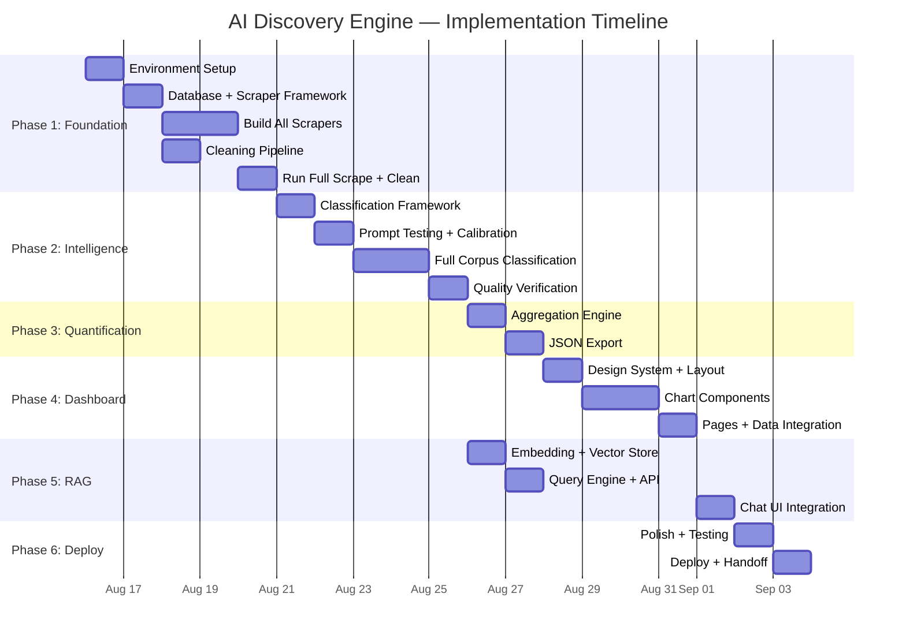

# Phase-Wise Implementation Plan
### AI Discovery Engine — Myntra
### Estimated Timeline: 13 Days

---

## Overview



---

## Phase 1: Foundation & Data Collection (Days 1–4)

### Objective
Set up the entire development environment, build all 7 scrapers, collect the full raw corpus, and clean/deduplicate it — producing the dataset that feeds everything downstream.

### Day 1: Environment + Database

| # | Task | Time | Output | Reference Doc |
|---|---|---|---|---|
| 1.1 | Create full project directory structure | 30 min | All folders exist | `architecture.md` §4 |
| 1.2 | Set up Python venv + install all dependencies | 30 min | Working venv with all packages | `env_setup_guide.md` §2 |
| 1.3 | Register all API keys (Gemini, Groq, Reddit, YouTube) | 45 min | All keys in `.env` | `env_setup_guide.md` §3 |
| 1.4 | Run verification checklist | 15 min | All ✅ checks pass | `env_setup_guide.md` §8 |
| 1.5 | Create SQLAlchemy models + initialize SQLite DB | 1 hr | `data/db.sqlite` exists with tables | `architecture.md` §2.5 |
| 1.6 | Build `BaseScraper` abstract class | 1 hr | `base_scraper.py` with common interface | `architecture.md` §2.1 |
| 1.7 | Build checkpoint/resume utility | 45 min | Checkpoint save/load working | `scraper_config.md` §8 |
| 1.8 | Build retry + exponential backoff utility | 30 min | `tenacity`-based retry decorator | `scraper_config.md` §8 |
| 1.9 | Initialize Git repo + `.gitignore` | 15 min | Clean repo | `env_setup_guide.md` §7 |

**Day 1 deliverable:** Working dev environment, database schema, scraper framework ready.

### Day 2: Build Scrapers (Part 1 — Primary Sources)

| # | Task | Time | Output | Reference Doc |
|---|---|---|---|---|
| 2.1 | Build Play Store scraper | 2 hr | `playstore_scraper.py` — test with 100 reviews | `scraper_config.md` §1 |
| 2.2 | Build App Store scraper | 1.5 hr | `appstore_scraper.py` — RSS + scraping fallback | `scraper_config.md` §2 |
| 2.3 | Build Reddit scraper | 2 hr | `reddit_scraper.py` — PRAW with all subreddits + queries | `scraper_config.md` §3 |
| 2.4 | Build YouTube scraper | 2 hr | `youtube_scraper.py` — video search + comment extraction | `scraper_config.md` §4 |
| 2.5 | Unit test all 4 scrapers (100 docs each) | 1 hr | All produce valid unified-schema docs | `testing_plan.md` §2 |

**Day 2 deliverable:** All 4 primary scrapers built and tested.

### Day 3: Build Scrapers (Part 2) + Run Full Scrape

| # | Task | Time | Output | Reference Doc |
|---|---|---|---|---|
| 3.1 | Build Trustpilot scraper (Playwright) | 1.5 hr | `trustpilot_scraper.py` | `scraper_config.md` §5 |
| 3.2 | Build PissedConsumer scraper | 1 hr | `pissedconsumer_scraper.py` | `scraper_config.md` §6 |
| 3.3 | Build Reviews.io scraper | 45 min | `reviewsio_scraper.py` | `scraper_config.md` §7 |
| 3.4 | Build orchestrator (parallel execution) | 1 hr | `orchestrator.py` — runs all scrapers | `scraper_config.md` §8 |
| 3.5 | **Run full scrape — primary sources** | 3–4 hr (background) | `data/raw/` populated | — |
| 3.6 | **Run full scrape — secondary sources** | 1 hr (background) | `data/raw/` complete | — |
| 3.7 | Spot-check 50 random docs per source | 1 hr | Manual verification pass | `testing_plan.md` §2.4 |

**Day 3 deliverable:** Full raw corpus collected (~80K–100K documents).

### Day 4: Cleaning Pipeline

| # | Task | Time | Output | Reference Doc |
|---|---|---|---|---|
| 4.1 | Build language filter (English + Hinglish) | 1 hr | `cleaning/normalizer.py` | `architecture.md` §2.2 |
| 4.2 | Build text normalizer | 1 hr | URL strip, unicode, emoji handling | `architecture.md` §2.2 |
| 4.3 | Build deduplicator (exact + MinHash) | 1.5 hr | `cleaning/deduplicator.py` | `architecture.md` §2.2 |
| 4.4 | Build relevance filter | 1 hr | `cleaning/relevance_filter.py` | `architecture.md` §2.2 |
| 4.5 | Build cleaning pipeline orchestrator | 1 hr | `cleaning/pipeline.py` — chains all steps | — |
| 4.6 | Run full cleaning pipeline | 1 hr | `data/clean/` populated | — |
| 4.7 | Verify statistics (dedup rate, retention rate) | 30 min | Stats within expected ranges | `testing_plan.md` §3.2 |
| 4.8 | Insert clean corpus into SQLite `documents` table | 30 min | DB populated and queryable | — |

**Day 4 deliverable:** Clean, deduplicated corpus (~70K–90K documents) in database.

### Phase 1 Exit Gate

- [ ] All 7 scrapers produce output
- [ ] Raw data in `data/raw/` (~80K+ documents)
- [ ] Clean data in `data/clean/` (~70K+ documents)
- [ ] SQLite DB populated with all clean documents
- [ ] Checkpoint files exist for all scrapers
- [ ] Statistical checks pass (dedup rate 3–8%, retention 70–90%)

---

## Phase 2: LLM Classification (Days 5–7)

### Objective
Build the classification pipeline, calibrate prompts, classify the entire corpus using the free LLM stack, and verify quality.

### Day 5: Classification Framework

| # | Task | Time | Output | Reference Doc |
|---|---|---|---|---|
| 5.1 | Build Pydantic models for classification schema | 1 hr | `classification/schema.py` | `llm_prompts.md` §1 |
| 5.2 | Build prompt templates (system + few-shot) | 1.5 hr | `classification/prompts.py` | `llm_prompts.md` §1–2 |
| 5.3 | Build Gemini API client (JSON mode) | 1.5 hr | `classification/classifier.py` | `architecture.md` §2.3 |
| 5.4 | Build Groq API client (JSON mode) | 1 hr | Added to `classifier.py` | `architecture.md` §2.3 |
| 5.5 | Build Ollama client (local fallback) | 45 min | Added to `classifier.py` | `architecture.md` §2.3 |
| 5.6 | Build tiered failover logic | 1 hr | Auto-switch Gemini → Groq → Ollama on 429 | `architecture.md` §2.3 |
| 5.7 | Build post-classification validator | 1 hr | `classification/validator.py` | `llm_prompts.md` §5 |

**Day 5 deliverable:** Classification framework complete, all 3 LLM tiers wired up.

### Day 6: Prompt Calibration + Start Classification

| # | Task | Time | Output | Reference Doc |
|---|---|---|---|---|
| 6.1 | Test batch: classify 50 diverse documents | 1 hr | Raw output for manual review | `testing_plan.md` §4.1 |
| 6.2 | Manual review: grade 50 classifications | 1.5 hr | Quality scorecard (target >80% A/B) | `testing_plan.md` §4.2 |
| 6.3 | Adjust prompts if needed (tweak few-shot, add edge cases) | 1 hr | Updated prompts.py | — |
| 6.4 | Re-test if prompt was adjusted | 30 min | Improved quality scores | — |
| 6.5 | Build batch processor (10 docs/batch, rate limiting, checkpoints) | 1.5 hr | `classification/batch_processor.py` | `architecture.md` §2.3 |
| 6.6 | **Start full corpus classification** | Background | Classification running | — |
| 6.7 | Monitor: API calls, tokens, errors, failover events | Ongoing | Classification log | — |

**Day 6 deliverable:** Prompts calibrated, full classification started.

### Day 7: Complete Classification + Quality Check

| # | Task | Time | Output | Reference Doc |
|---|---|---|---|---|
| 7.1 | Monitor and resume classification if needed | 1 hr | All docs classified | — |
| 7.2 | Run validation pipeline on all classifications | 30 min | Validation report | `llm_prompts.md` §5 |
| 7.3 | Store results in SQLite (classifications + tag tables) | 1 hr | DB fully populated | `architecture.md` §2.5 |
| 7.4 | Sample 100 random classified docs — manual quality check | 2 hr | Quality benchmark (>80% A/B) | `testing_plan.md` §4.2 |
| 7.5 | Distribution sanity checks | 30 min | All distributions in expected ranges | `testing_plan.md` §4.4 |
| 7.6 | Fix any systematic issues + re-classify affected subset | 1–2 hr | Clean classifications | — |

**Day 7 deliverable:** Full corpus classified, quality verified, stored in database.

### Phase 2 Exit Gate

- [ ] All clean documents classified and stored in DB
- [ ] Manual spot-check shows >80% accuracy
- [ ] Validation failure rate < 5%
- [ ] Distribution sanity checks pass
- [ ] All LLM API costs = $0

---

## Phase 3: Quantification & Export (Day 8)

### Objective
Aggregate classification tags into quantified insights per question and export all JSON data files that the dashboard will consume.

### Day 8: Aggregation + Export

| # | Task | Time | Output | Reference Doc |
|---|---|---|---|---|
| 8.1 | Build `aggregator.py` — tag frequency SQL queries | 1.5 hr | Working aggregation functions | `architecture.md` §2.4 |
| 8.2 | Build cross-tabulation (hesitation × segment, factor × source) | 1 hr | Cross-tab query functions | `architecture.md` §2.4 |
| 8.3 | Build confidence-weighted + source-weighted roll-ups | 45 min | Weighted aggregation | `architecture.md` §2.4 |
| 8.4 | Build temporal trend aggregation (group by month) | 45 min | Monthly trend data | — |
| 8.5 | Build `question_mapper.py` — maps aggregates to 10 questions | 1.5 hr | Per-question data objects | `architecture.md` §2.4 |
| 8.6 | Build `export.py` — generates all JSON files | 2 hr | All JSON files created | `data_contracts.md` |
| 8.7 | Generate `summary.json` | 30 min | ✅ Validated | `data_contracts.md` §2 |
| 8.8 | Generate `q1.json` through `q10.json` | 1 hr | ✅ All 10 validated | `data_contracts.md` §3 |
| 8.9 | Generate `systemic_gaps.json` | 30 min | ✅ Validated | `data_contracts.md` §4 |
| 8.10 | Generate `corpus_meta.json` | 15 min | ✅ Validated | `data_contracts.md` §5 |
| 8.11 | Run consistency checks | 30 min | All checks pass | `testing_plan.md` §5 |
| 8.12 | Copy JSON to `dashboard/public/data/` | 5 min | Dashboard data ready | — |

**Day 8 deliverable:** All 14 JSON files exported, validated, and ready for dashboard.

### Phase 3 Exit Gate

- [ ] All JSON files exist in `dashboard/public/data/`
- [ ] All files pass schema validation
- [ ] Numbers are internally consistent
- [ ] Percentages and counts make sense

---

## Phase 4: Dashboard Build (Days 9–11)

### Objective
Build the full premium dashboard with 38+ interactive visualizations, responsive design, and glassmorphism aesthetic.

### Day 9: Design System + Layout + Basic Components

| # | Task | Time | Output | Reference Doc |
|---|---|---|---|---|
| 9.1 | Initialize Next.js project + install charting libraries | 30 min | Project scaffolded | `env_setup_guide.md` §5 |
| 9.2 | Create `globals.css` with full design system tokens | 1 hr | All CSS variables defined | `dashboard_ui_spec.md` §4, `architecture.md` §2.6 |
| 9.3 | Set up Google Fonts (Inter + Outfit) | 15 min | Fonts loading | `dashboard_ui_spec.md` §1 |
| 9.4 | Build `ChartWrapper.js` — glassmorphism card | 45 min | Reusable card wrapper | `dashboard_ui_spec.md` §4 |
| 9.5 | Build navbar (fixed, glassmorphism, nav items) | 1 hr | Working navigation | `dashboard_ui_spec.md` §2 |
| 9.6 | Build `layout.js` — global layout with nav + page transitions | 45 min | Layout ready | — |
| 9.7 | Build `StatCard.js` — KPI card with sparkline + counter animation | 1.5 hr | Working stat cards | `dashboard_ui_spec.md` §4.1 |
| 9.8 | Build `HorizontalBar.js` — gradient bars | 1.5 hr | Working bar chart | `dashboard_ui_spec.md` §4.2 |
| 9.9 | Build `DonutChart.js` — animated donut | 1 hr | Working donut | `dashboard_ui_spec.md` §4.3 |
| 9.10 | Build `lib/api.js` — data fetching utilities | 30 min | Data loading functions | — |
| 9.11 | Build `lib/constants.js` — question text, colors | 30 min | Constants file | — |

**Day 9 deliverable:** Design system, layout, navbar, and 3 core chart components working.

### Day 10: Chart Components + Summary Page

| # | Task | Time | Output | Reference Doc |
|---|---|---|---|---|
| 10.1 | Build `GroupedBar.js` | 1 hr | Working grouped bar | `dashboard_ui_spec.md` §4.2 |
| 10.2 | Build `StackedBar.js` | 1 hr | Working stacked bar | `dashboard_ui_spec.md` §4.2 |
| 10.3 | Build `RadarChart.js` | 1 hr | Working radar/spider chart | `dashboard_ui_spec.md` §4.4 |
| 10.4 | Build `AreaTimeline.js` | 45 min | Working area chart | — |
| 10.5 | Build `TreemapChart.js` | 45 min | Working treemap | — |
| 10.6 | Build `HeatmapChart.js` (Nivo wrapper) | 1 hr | Working heatmap | `dashboard_ui_spec.md` §4.5 |
| 10.7 | Build `SankeyDiagram.js` (Nivo wrapper) | 1 hr | Working Sankey | `dashboard_ui_spec.md` §4.6 |
| 10.8 | Build `ScatterPlot.js` | 45 min | Working scatter | — |
| 10.9 | Build `WordCloud.js` | 45 min | Working word cloud | `dashboard_ui_spec.md` §4.7 |
| 10.10 | Build helper components: `ConfidenceBadge`, `SourceBadge`, `SegmentToggle`, `FilterBar` | 1.5 hr | All helper components | `dashboard_ui_spec.md` §4.8–4.9 |
| 10.11 | Build `QuoteCard.js` + `QuoteCarousel.js` | 1 hr | Working quote components | `dashboard_ui_spec.md` §4.8 |
| 10.12 | Build Summary page (`page.js`) — wire stat cards + charts to `summary.json` | 1 hr | Working summary page | `architecture.md` §2.7 |

**Day 10 deliverable:** All chart components built. Summary page live with real data.

### Day 11: Question Pages + Systemic Gaps + Chat UI

| # | Task | Time | Output | Reference Doc |
|---|---|---|---|---|
| 11.1 | Build `QuestionSection.js` — reusable section with all sub-charts | 2 hr | Dynamic question renderer | `architecture.md` §2.7 |
| 11.2 | Build `questions/[id]/page.js` — dynamic routing, loads q{id}.json | 1.5 hr | All 10 question pages work | `data_contracts.md` §3 |
| 11.3 | Add question-specific extras (Q5 heatmap, Q6 Sankey, Q7 radar, Q8 word cloud, Q10 table) | 2 hr | Specialized visualizations | `architecture.md` §2.7 |
| 11.4 | Build Systemic Gaps page | 1.5 hr | Working gaps page | `data_contracts.md` §4 |
| 11.5 | Build Chat Interface UI (no RAG yet — static UI) | 1.5 hr | Chat UI with input, suggested queries | `dashboard_ui_spec.md` §4.10 |
| 11.6 | Wire segment toggle to filter all charts within each question section | 1 hr | Segment filtering works globally | — |
| 11.7 | Add entrance animations (staggered chart draw via Intersection Observer) | 45 min | Charts animate as they enter viewport | `dashboard_ui_spec.md` §6 |
| 11.8 | Test all pages with real data — fix any rendering issues | 1 hr | All 38+ charts rendering correctly | — |

**Day 11 deliverable:** Full dashboard with all pages, all charts, segment toggle, animations.

### Phase 4 Exit Gate

- [ ] All pages render with real data
- [ ] All 38+ charts are interactive
- [ ] Segment toggle works across all question sections
- [ ] Responsive at desktop and tablet breakpoints
- [ ] No console errors
- [ ] Entrance animations work

---

## Phase 5: RAG & Chat (Day 12)

### Objective
Build the embedding pipeline, vector store, query engine, and wire it all into the chat interface.

> **Note:** Embedding work (5.1–5.2) can start in parallel with Phase 4 (as early as Day 9) since it only depends on the clean corpus, not the dashboard.

### Day 12: Full RAG Pipeline

| # | Task | Time | Output | Reference Doc |
|---|---|---|---|---|
| 12.1 | Build `rag/embedder.py` — embed clean corpus | 1 hr | Embedding functions working | `architecture.md` §2.9 |
| 12.2 | Build `rag/indexer.py` — ChromaDB index creation | 1 hr | Vector store populated | `architecture.md` §2.9 |
| 12.3 | Run full embedding pipeline | 1–2 hr (background) | All docs embedded + indexed | — |
| 12.4 | Build `rag/query_engine.py` — retrieval + answer generation | 2 hr | Query engine with citations | `architecture.md` §2.9 |
| 12.5 | Test with 10 diverse queries — verify quality | 1 hr | Answer quality > 3.5/5 avg | `testing_plan.md` §7 |
| 12.6 | Build `/api/ask` endpoint (Next.js API route) | 1 hr | RAG API working | `architecture.md` §5 |
| 12.7 | Wire `ChatInterface.js` to live RAG API | 1 hr | End-to-end chat working | `dashboard_ui_spec.md` §4.10 |
| 12.8 | Add filter dropdowns (segment, source) to chat | 30 min | Filtered retrieval working | — |
| 12.9 | Test edge cases (empty query, long query, off-topic) | 30 min | Graceful error handling | `testing_plan.md` §7.3 |

**Day 12 deliverable:** RAG fully working — type a question, get a cited answer.

### Phase 5 Exit Gate

- [ ] Chat interface returns accurate, cited answers
- [ ] Filters (segment, source) narrow retrieval correctly
- [ ] Response time < 5 seconds
- [ ] Edge cases handled gracefully

---

## Phase 6: Polish & Deploy (Day 13)

### Objective
Final polish, performance optimization, comprehensive testing, deployment, and handoff.

### Day 13: Ship It

| # | Task | Time | Output | Reference Doc |
|---|---|---|---|---|
| 13.1 | Visual review — all pages for consistency | 45 min | No visual bugs | `dashboard_ui_spec.md` |
| 13.2 | Test loading states (skeleton shimmer) | 30 min | All components show skeleton on load | `dashboard_ui_spec.md` §5 |
| 13.3 | Test empty/error states | 30 min | Graceful fallbacks | `dashboard_ui_spec.md` §5 |
| 13.4 | Accessibility check (keyboard nav, focus indicators) | 30 min | All interactive elements focusable | `dashboard_ui_spec.md` §7 |
| 13.5 | Run Lighthouse audit — target >90 all categories | 30 min | Performance metrics met | `testing_plan.md` §6.3 |
| 13.6 | Fix any performance issues (lazy load, code split) | 1 hr | Bundle < 500KB gzipped | `dashboard_ui_spec.md` §8 |
| 13.7 | Run production build (`npm run build`) | 15 min | Build succeeds | `deployment_runbook.md` §2.2 |
| 13.8 | Set up Vercel project + environment variables | 30 min | Vercel configured | `deployment_runbook.md` §3.1 |
| 13.9 | Deploy to Vercel (`vercel --prod`) | 15 min | Live URL generated | `deployment_runbook.md` §3.2 |
| 13.10 | Post-deploy smoke test (all pages + RAG) | 30 min | All features working on live URL | `deployment_runbook.md` §4 |
| 13.11 | Cross-browser check (Chrome, Firefox, Safari) | 30 min | No browser-specific issues | `deployment_runbook.md` §4.4 |
| 13.12 | Update README.md | 30 min | Complete project documentation | — |
| 13.13 | Share testable link | 5 min | **🎉 Deliverable complete** | `deployment_runbook.md` §8 |

**Day 13 deliverable:** Dashboard live on public URL, all features working, link shared.

### Phase 6 Exit Gate

- [ ] Dashboard live on public Vercel URL
- [ ] All features working end-to-end
- [ ] Lighthouse score > 90
- [ ] README complete
- [ ] Testable link shared

---

## Dependencies Map

```mermaid
graph LR
    P1A["1. Env Setup"] --> P1B["2. Scrapers"]
    P1B --> P1C["3. Run Scrape"]
    P1C --> P1D["4. Cleaning"]
    P1D --> P2A["5. Classification Framework"]
    P2A --> P2B["6. Prompt Calibration"]
    P2B --> P2C["7. Full Classification"]
    P2C --> P3A["8. Quantification + Export"]
    P3A --> P4A["9. Dashboard Design System"]
    P4A --> P4B["10. Chart Components"]
    P4B --> P4C["11. Pages + Data"]
    
    P1D --> P5A["12. Embeddings (parallel)"]
    P5A --> P5B["13. RAG Engine"]
    P5B --> P5C["14. Chat Integration"]
    P4C --> P5C
    
    P5C --> P6["15. Polish + Deploy"]
```



### Parallel Tracks

| Track A (Pipeline) | Track B (Dashboard) | Track C (RAG) |
|---|---|---|
| Days 1–8 | Days 9–11 | Days 9–12 (partial overlap) |
| Scraping → Cleaning → Classification → Quantification | Design system → Charts → Pages | Embedding → Vector store → Query engine |

> **Optimization:** If two people are working, one can start the dashboard design system (Day 9) while the other finishes quantification (Day 8). RAG embedding can also start as soon as the clean corpus is ready (Day 4), running in background while classification proceeds.

---

## Risk Mitigation per Phase

| Phase | Top Risk | Mitigation | Fallback |
|---|---|---|---|
| Phase 1 | Play Store scraper breaks | Cache aggressively; test with small batch first | Manual CSV export from Play Store web |
| Phase 2 | Gemini free quota hit mid-run | Auto-failover to Groq → Ollama; spread across days | Classify in batches across 3–4 days |
| Phase 3 | Thin data for some questions | Broaden search terms; merge related sub-questions | Show "insufficient data" label in dashboard |
| Phase 4 | Nivo/Recharts rendering issues | Have Chart.js as backup for complex charts | Simplify visualization (table instead of Sankey) |
| Phase 5 | RAG answers are inaccurate | Tune retrieval (top-k, filters); improve prompts | Show "experimental" badge on RAG answers |
| Phase 6 | Vercel build fails | Debug locally with `npm run build`; check bundle size | Deploy to Render.com as alternative |

---

## Daily Standup Template

```markdown
## Day [N] Standup

### Completed Yesterday
- [ ] Task X
- [ ] Task Y

### Plan for Today
- [ ] Task A (estimated: 2 hr)
- [ ] Task B (estimated: 1.5 hr)

### Blockers
- [None / description of blocker]

### Running Total
- Docs scraped: ___
- Docs classified: ___
- Charts built: ___ / 38
- Pages completed: ___ / 13
```

---

## Success Metrics

| Metric | Target | Measured When |
|---|---|---|
| Total reviews analyzed | >50,000 | End of Phase 1 |
| Classification accuracy | >80% (manual spot-check) | End of Phase 2 |
| Dashboard charts working | 38+ | End of Phase 4 |
| RAG answer quality | >3.5/5 average | End of Phase 5 |
| Lighthouse performance score | >90 | End of Phase 6 |
| Total LLM cost | $0 | Continuous |
| Total calendar days | ≤13 | End of Phase 6 |
| Testable public link | ✅ Working | End of Phase 6 |
